# <구현기능>

> 기본 기능
>
> > 1. 식품정보 관리
> >
> > > * [메인페이지](#main)
> > > * [상품 상세 정보 및 영양 정보](#detail_info)
> > > * [상품명 검색](#search_name)
> >
> > 2.  회원관리 ( 로그인/ 로그아웃)
> >
> > > * [회원정보 등록](#mem_register)
> > > * [회원정보 수정 및 삭제](#mem_up_del) ( 로그인 시 활성화 )
> > > * [로그인](#mem_login)/ [로그아웃](#mem_logout)
> >
> > 3. 예상 섭취 내역
> >
> > - [예상 섭취 내역](#expect)
> >
> > 4. QnA 게시판
> >
> > - [Q&A 게시판, 글쓰기, 상세정보](#QnA)

# 메인페이지 <a name="main">

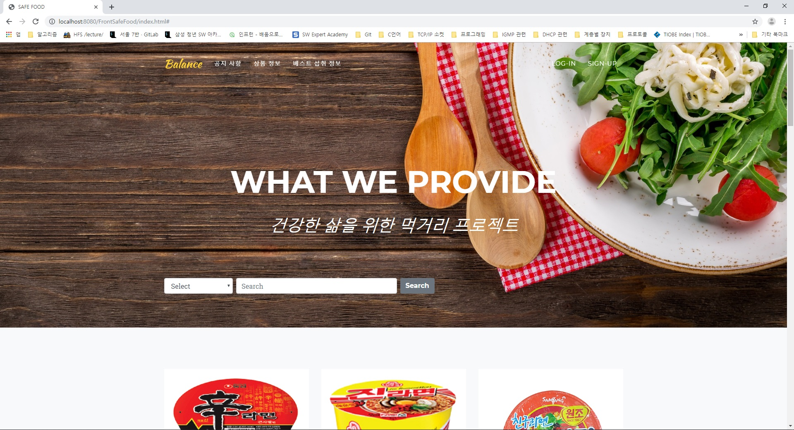

# 상품명 검색<a name="search_name">

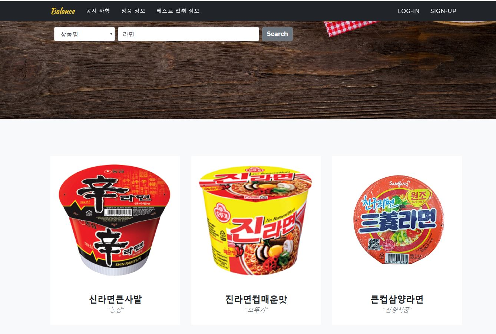

# 상품 상세 정보 및 영양 정보<a name="detail_info"/>

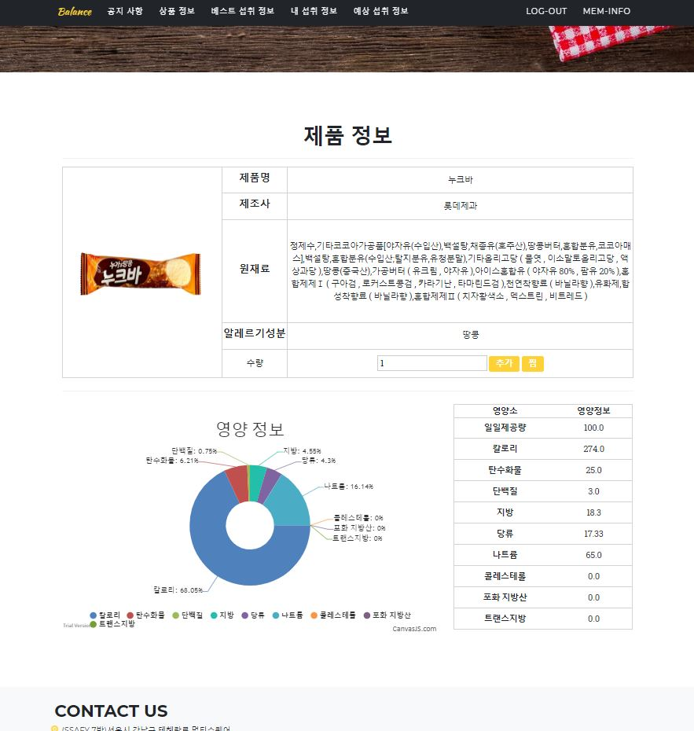

# 회원정보 등록 <a name="mem_register"/>

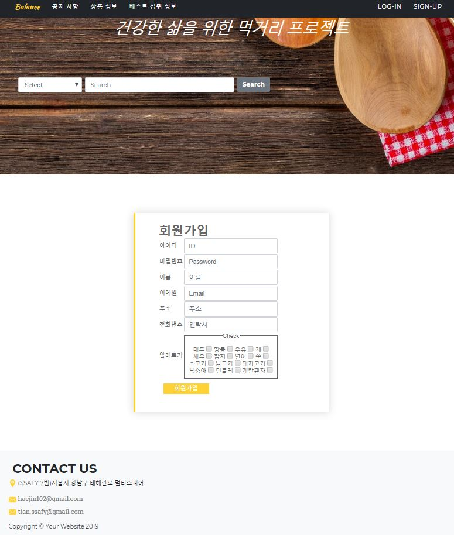

# 회원정보 수정 삭제 <a name="mem_up_del"/>

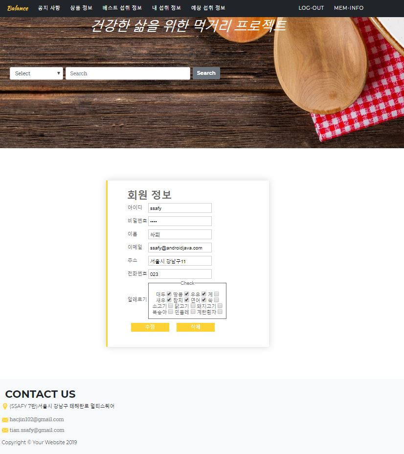

# 로그인<a name="mem_login"/>

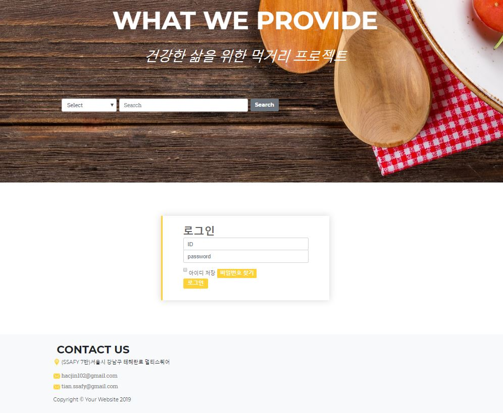

# 로그아웃 <a name="mem_logout"/>

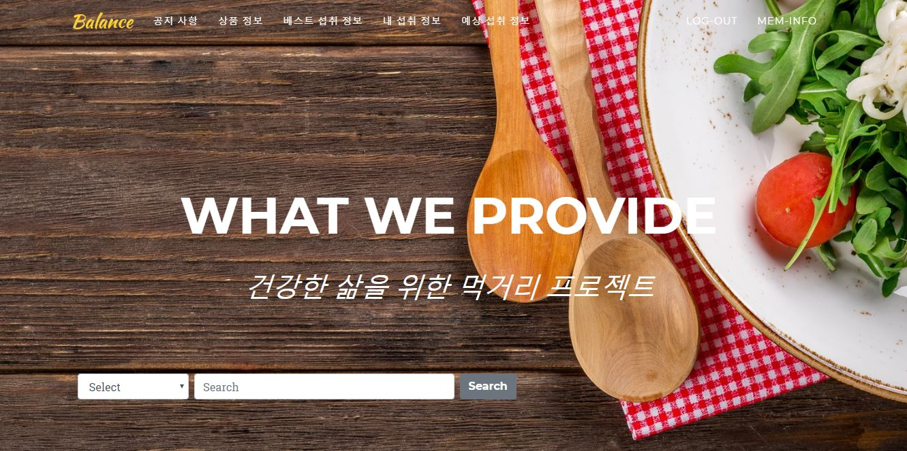

# Class Diagram (UML)

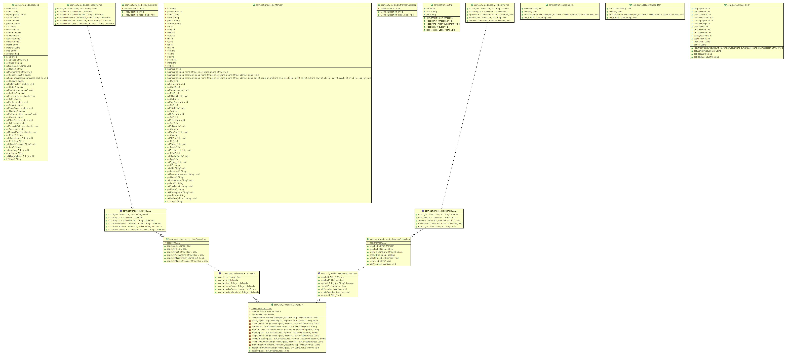

# 예상 섭취 정보<a name="expect"/>

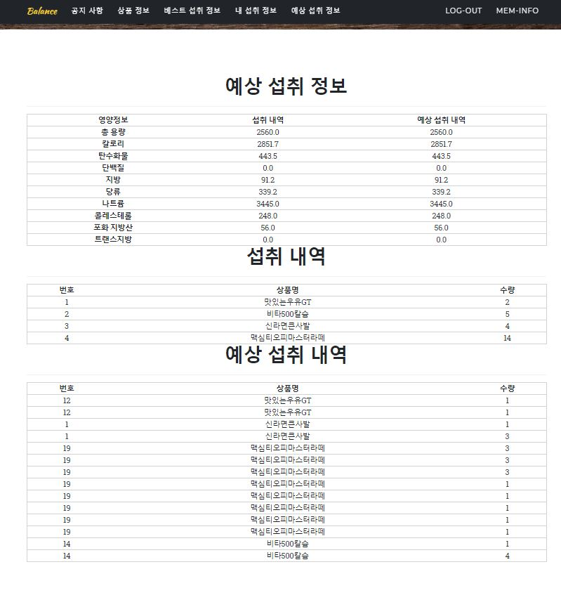

# Q&A게시판<a name="QnA"/>

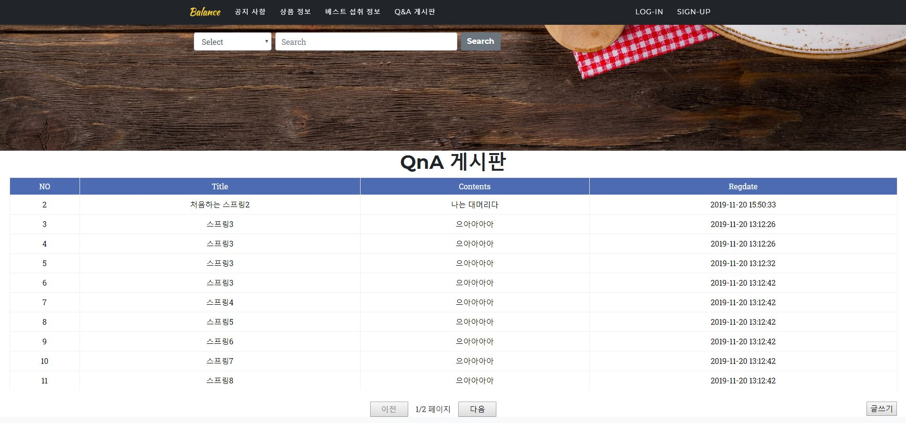

# Q&A 글쓰기

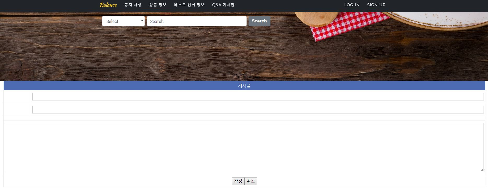

# Q&A 상세 정보

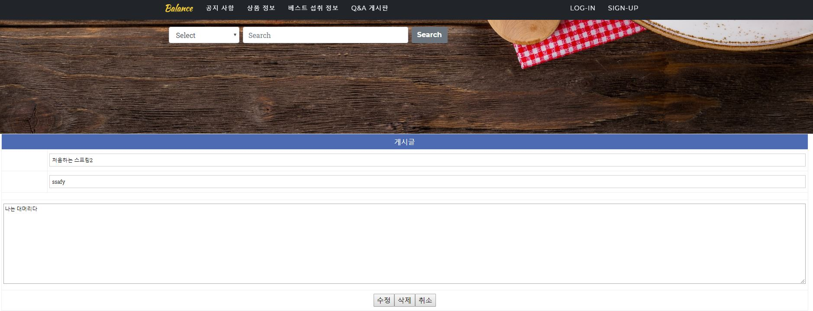